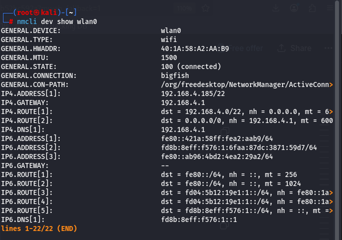
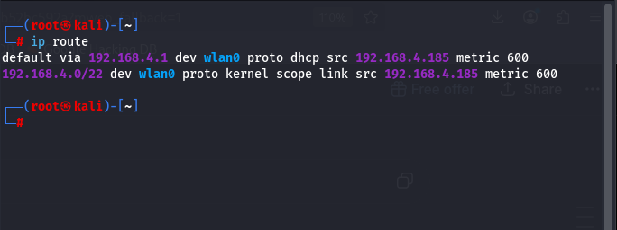
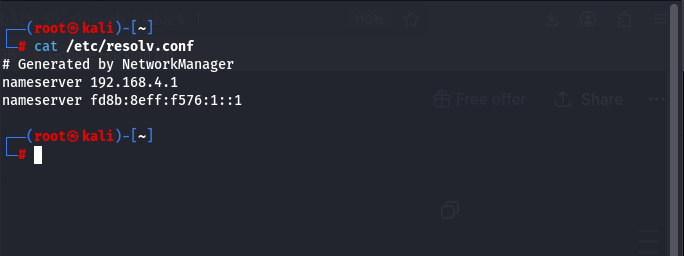

# Wi-Fi Troubleshooting Guide

## Overview

This guide documents the troubleshooting process used to diagnose and resolve Wi-Fi connectivity issues on my Kali Linux home lab.

---

## System Information

Operating System:
- Kali Linux Rolling

Wireless Adapter:
- Realtek RTL8852BE Wi-Fi 6

Connection Manager:
- NetworkManager

---

## Problems Encountered

- Slow Wi-Fi performance
- DNS resolution issues
- ProtonVPN connection problems
- Power saving causing unstable wireless behavior
- Driver verification
- Network configuration analysis

---

## Diagnostic Commands Used

### NetworkManager Device Information

```bash
nmcli dev show wlan0
```



---

### Routing Table

```bash
ip route
```



---

### DNS Configuration

```bash
cat /etc/resolv.conf
```



---

### Wi-Fi Power Saving

```bash
iw dev wlan0 get power_save
```


---

## Troubleshooting Steps

### 1. Verified network interface

Confirmed the wireless adapter was connected and receiving an IP address.

### 2. Verified DNS configuration

Checked `/etc/resolv.conf` and confirmed DNS servers supplied by the router.

### 3. Verified routing

Checked the default gateway using `ip route`.

### 4. Verified Wi-Fi power saving

Confirmed power saving status using:

```bash
iw dev wlan0 get power_save
```

Power saving was enabled and evaluated as a possible cause of connection instability.

### 5. Reviewed NetworkManager configuration

Verified interface configuration using:

```bash
nmcli dev show wlan0
```

### 6. Reviewed system logs

Used:

```bash
journalctl
```

to investigate driver and networking events.

---

## Skills Demonstrated

- Linux Administration
- Network Troubleshooting
- Wi-Fi Diagnostics
- DNS
- DHCP
- Routing
- Command Line
- NetworkManager
- Documentation

---

## Lessons Learned

This troubleshooting exercise improved my understanding of Linux networking, wireless adapter diagnostics, DNS configuration, and structured problem-solving techniques commonly used in IT Support environments.
